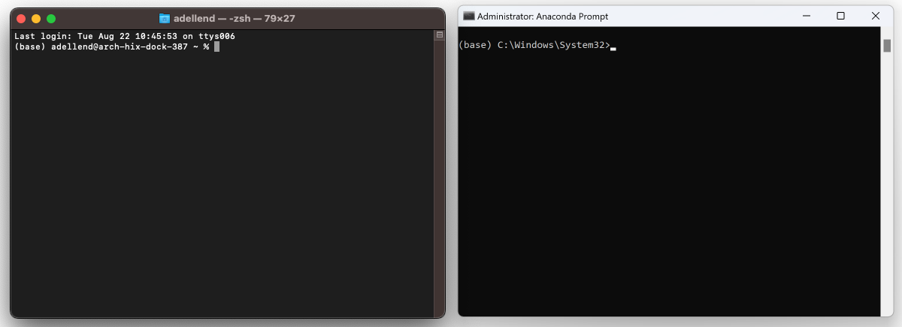
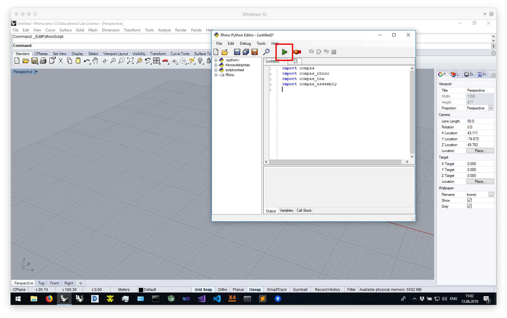

# WS_Segovia23
International Summer School on Historic Masonry - Segovia 2023

*Computational assessment of masonry structures*

* https://www.himass.org/
* https://github.com/compas-dev/compas
* https://github.com/BlockResearchGroup/compas_assembly
* https://github.com/BlockResearchGroup/compas_cra
* https://github.com/BlockResearchGroup/compas_tno


## Schedule

**Wednesday 30/08/2023**

Time | Topic
---  | ---
18.15 - 19.30 | Lecture Prof. Philippe Block

**Friday 01/09/2023**

Time | Topic
---  | ---
18.15 - 18.50 | Lecture on Discrete Element Modelling (DEM) - Dr. Alessandro Dell'Endice
18.55 - 19.30 | Lecture on Thrust Network Analysis (TNA) - Dr. Ricardo Maia Avelino
 
**Monday  04/09/2023**

Time | Topic
---  | ---
15.00 - 16.30 | COMPAS Masonry workshop - Part 1 (CRA) - Dr. Alessandro Dell'Endice
17.00 - 18.15 | COMPAS Masonry workshop - Part 2 (TNO) - Dr. Ricardo Maia Avelino

</br>

## Preparations

**1. Requirements**

* [Anaconda 3](https://www.anaconda.com/distribution/)
* [Rhino 6/7](https://www.rhino3d.com/download)
* [Visual Studio Code](https://code.visualstudio.com/): Any python editor works, but we recommend [VSCode + extensions](https://compas.dev/compas/latest/gettingstarted/vscode.html)

During the installation of the various tools, just accept all default settings.
The default location for installing Anaconda is usually in the home directory.
If it isn't, try to install it there anyway.
And make sure not to register it on the `PATH` (Windows only).
On Windows, the path to the home directory is stored in the variable `%USERPROFILE%`.
On Mac, it is accessible through `~`.
This results in the following recommended installation directories for Anaconda.

*On Windows*

```
%USERPROFILE%\Anaconda3
```

*On Mac*

```
~/anaconda3
```

## Installation

** The command line**

Many instructions in the next sections will have to be run from "the command line".

On Windows, use the "Anaconda Prompt" instead of the "Command Prompt", and make sure to run it *as administrator*.

> To find the Anaconda Prompt open the Start Menu and type "Anaconda".
> The Anaconda Prompt should already show up in the list of search results.
> To launch is as administrator, right click and select "Run as administrator".

On Mac, use the "Terminal".

**For simplicity, this guide will refer to both Terminal and Anaconda Prompt as "the command line".**



We will use the command line to install the COMPAS Python packages (and their dependencies) required for the workshop.

> **NOTE**: If you're on Windows, all commands below have to be executed in the *Anaconda Prompt* (NOT the *Command Prompt*)

We use `conda` to make sure we have clean, isolated environment for dependencies.

<details><summary>First time using <code>conda</code>?</summary>
<p>

Make sure you run this at least once:

    (base) conda config --add channels conda-forge

</p>
</details>

    (base) conda env create -f https://dfab.link/mcneel22.yml

### Add to Rhino

    (base)  conda activate WS_Segovia23
    (WS_Segovia23) python -m compas_rhino.install -v 7.0

If this is the first time you are using Rhino for Windows, or if you have never opened its
PythonScriptEditor before, do so now: open Rhino and open the editor by typing `EditPythonScript`.
Then simply close Rhino again.

To check the installation, launch Rhino, open the PythonScriptEditor, and try
importing the COMPAS packages in a script.
Then run the script and if no errors pop up, you are good to go.

```python
import compas
import compas_rhino
import compas_assembly
```



### Get the workshop files

Clone the repository:

```
(WS_Segovia23) cd Documents
(WS_Segovia23) git clone https://github.com/BRG-teaching/WS_Segovia23.git
```

### Verify installation

    (WS_Segovia23) python -m compas

    Yay! COMPAS is installed correctly!

    COMPAS: 1.17.0
    Python: 3.9.13 (CPython)
    Extensions: ['compas-cgal', 'compas-gmsh', 'compas-rrc', 'compas-fab', 'compas-occ', 'compas-view2']

## Help

If you need help with the installation process, please post a note on the workshop Slack channel: 

Otherwise, you can also contact us via email at dellendice@arch.ethz.ch.


